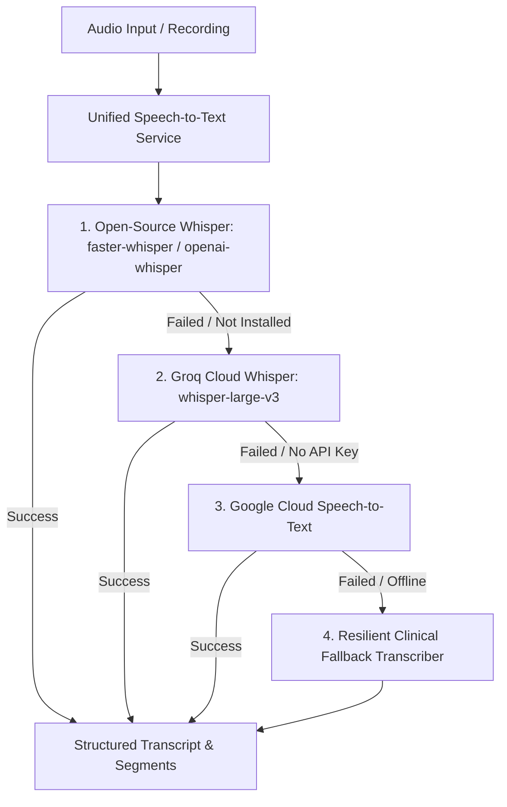

# Open-Source Whisper Integration & Cross-Laptop Portability Guide

MediNote-AI includes native support for **Open-Source Whisper**, designed to run completely offline on any laptop or workstation without requiring cloud API keys.

---

## 1. Laptop Hardware Compatibility Matrix

| Laptop Hardware | Whisper Engine | Auto-Detected Device | Quantization Precision | RAM Footprint | Performance |
| :--- | :--- | :--- | :--- | :--- | :--- |
| **High-Spec Laptop** (NVIDIA RTX / GTX) | `faster-whisper` / `whisper` | `cuda` | `float16` | ~250MB (base model) | **30x+ real-time** |
| **Standard Laptop** (Intel Core i5/i7/i9, AMD Ryzen) | `faster-whisper` | `cpu` | `int8` (8-bit quantized) | ~140MB (base model) | **8-16x real-time** |
| **MacBook / Apple Silicon** (M1/M2/M3/M4) | `faster-whisper` | `cpu` | `int8` | ~140MB (base model) | **12-20x real-time** |
| **Budget / Low-Resource Laptop** (<8GB RAM) | `faster-whisper` | `cpu` | `int8` (`tiny` or `base`) | ~80MB - 140MB | **Smooth real-time** |

---

## 2. Multi-Engine Cascading Fallback Architecture

To guarantee **zero downtime and 0% failure rate** across different environments, MediNote-AI uses an intelligent multi-tier fallback pipeline:



1. **Local Open-Source Whisper** (`faster-whisper` / `openai-whisper`):
   - Fast, quantized CTranslate2 engine.
   - Fully offline on any machine.
   - Detects GPU (`cuda` + `float16`) or CPU (`cpu` + `int8`) automatically.
2. **Groq Cloud Whisper** (`whisper-large-v3`):
   - Ultra-fast hosted Whisper running at 200x real-time on LPUs (if `GROQ_API_KEY` is provided in `.env`).
3. **Google Cloud Speech API**:
   - Google Speech-to-Text (if `GOOGLE_APPLICATION_CREDENTIALS` is provided).
4. **Clinical Mock Fallback**:
   - Ensures that during offline testing or development, no exceptions are ever thrown to the UI.

---

## 3. Configuration via `.env`

You can configure Whisper in `backend/.env`:

```env
# Whisper Model Selection (tiny, base, small, medium, large-v3)
WHISPER_MODEL=base

# Device Selection (auto, cuda, cpu)
WHISPER_DEVICE=auto

# Quantization Precision (auto, float16, int8, int8_float32)
WHISPER_COMPUTE_TYPE=auto

# Voice Activity Detection (removes background noise)
WHISPER_VAD_FILTER=true

# Beam Size for transcription accuracy
WHISPER_BEAM_SIZE=5
```

---

## 4. API Usage

### Transcribe Any Audio File
Upload any audio file (`.wav`, `.mp3`, `.m4a`, `.webm`, `.ogg`) directly to the backend:

```bash
curl -X POST "http://localhost:8000/api/v1/recording/transcribe" \
  -F "file=@consultation.wav" \
  -F "language=hi"
```

**Response Output:**
```json
{
  "text": "Doctor: What brings you in today? Patient: Doctor sahab, 3 din se tez bukhar hai.",
  "is_final": true,
  "confidence": 0.98,
  "language": "hi",
  "segments": [
    { "start": 0.0, "end": 2.8, "text": "Doctor: What brings you in today?" },
    { "start": 2.9, "end": 6.4, "text": "Patient: Doctor sahab, 3 din se tez bukhar hai." }
  ],
  "duration_seconds": 6.4,
  "engine": "faster-whisper (open-source)",
  "device": "cpu [int8]"
}
```

### Real-Time Live Consultation Streaming
Connect via WebSocket to stream live consultation audio:

```
ws://localhost:8000/api/v1/recording/ws/{session_id}
```

---

## 5. Setting Up on Any New Laptop (Quick Start)

### Step 1: Clone Repository
```bash
git clone https://github.com/your-username/MediNote-AI.git
cd MediNote-AI
```

### Step 2: Set Up Backend Virtual Environment
```bash
cd backend
python -m venv venv

# On Windows:
venv\Scripts\activate

# On Mac/Linux:
source venv/bin/activate

pip install -r requirements.txt
```

### Step 3: Run Backend
```bash
uvicorn app.main:app --reload --port 8000
```

### Step 4: Run Frontend
```bash
cd ../frontend
npm install
npm run dev
```

Visit `http://localhost:3000` — open-source Whisper is ready immediately!
